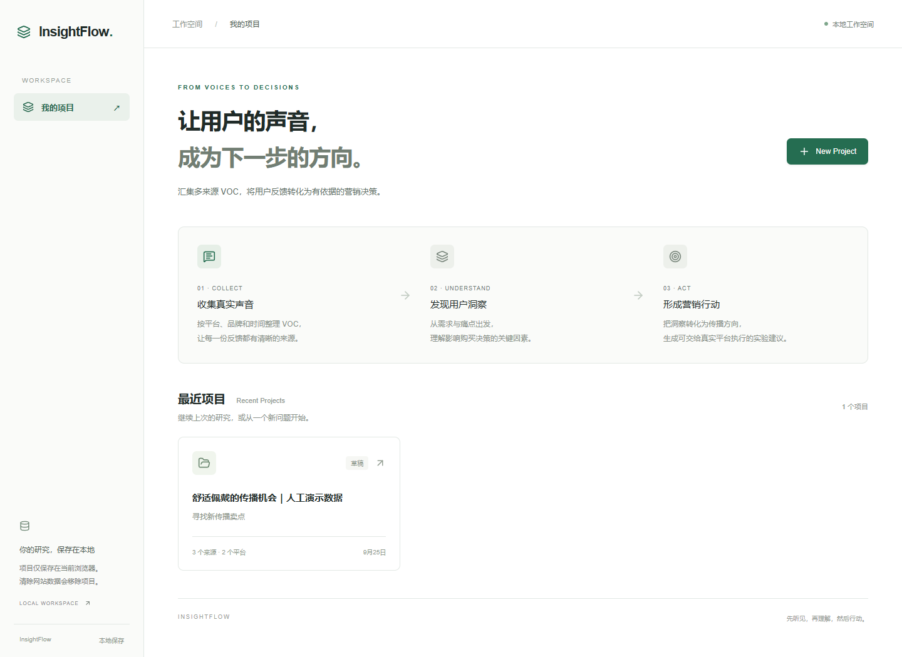
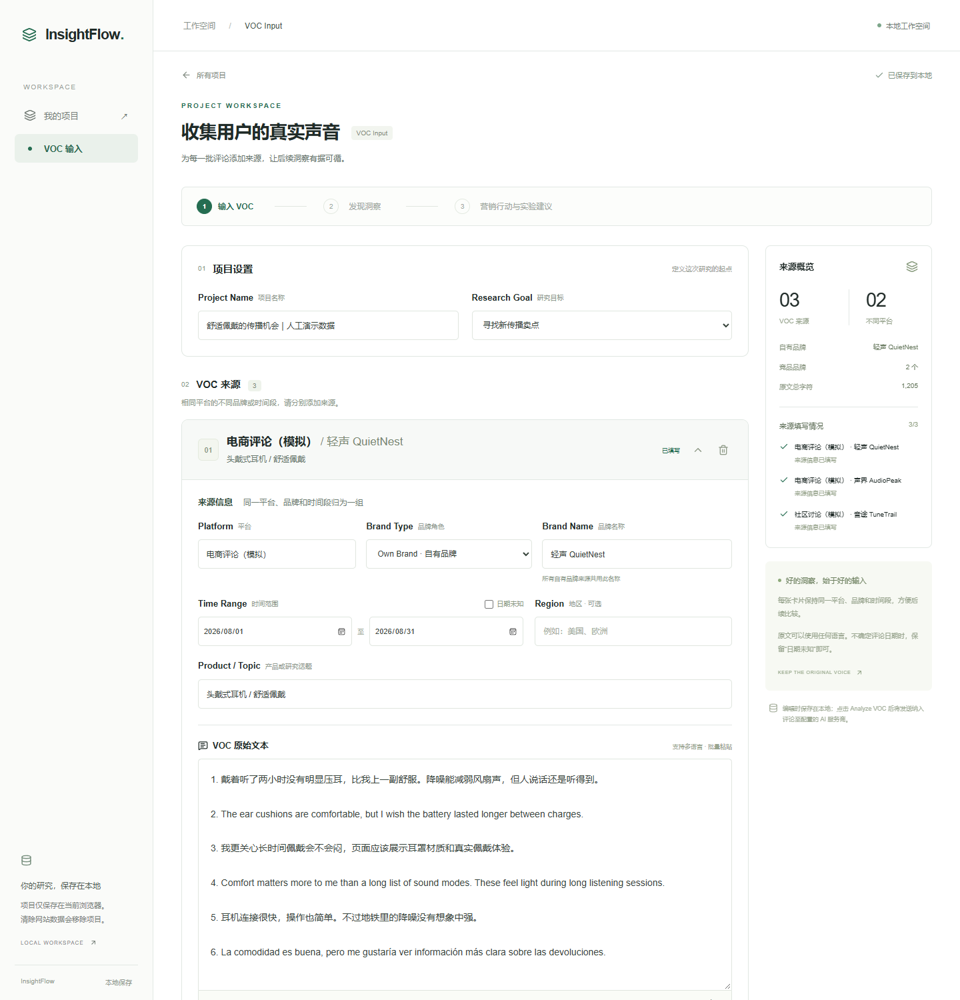
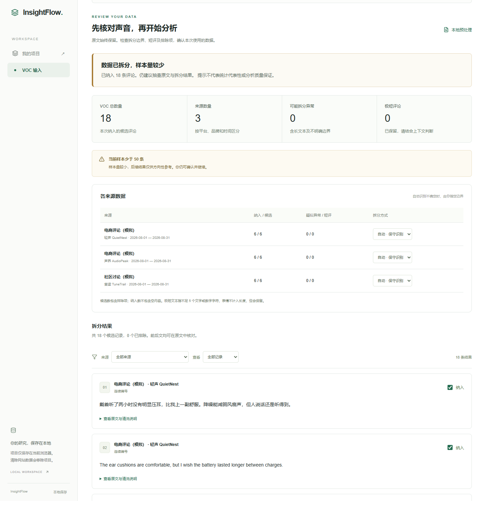
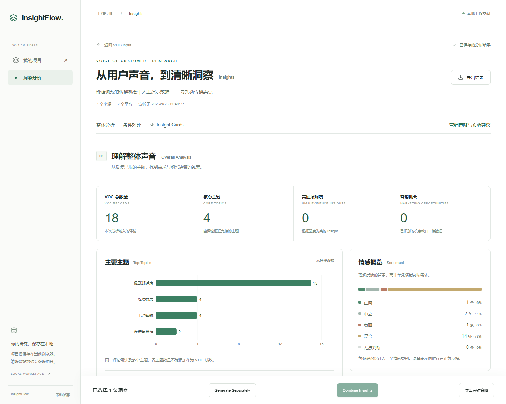
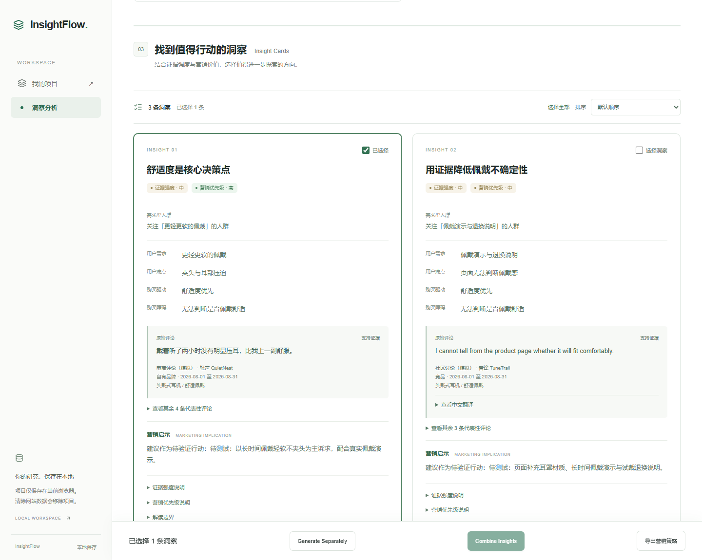
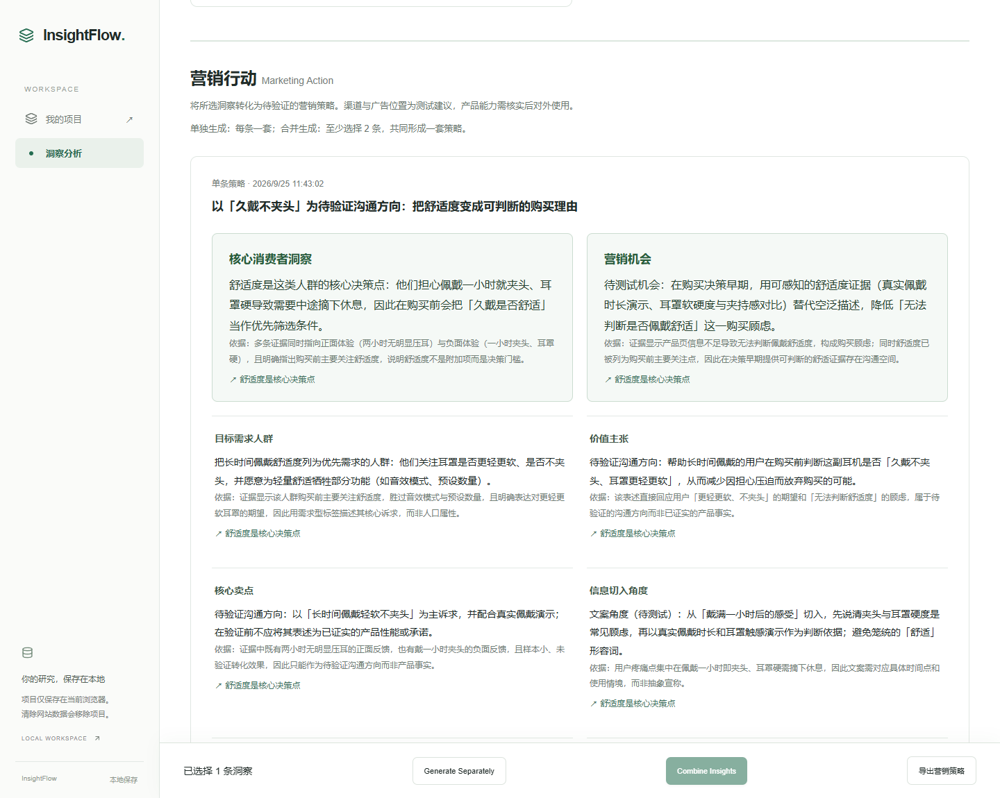
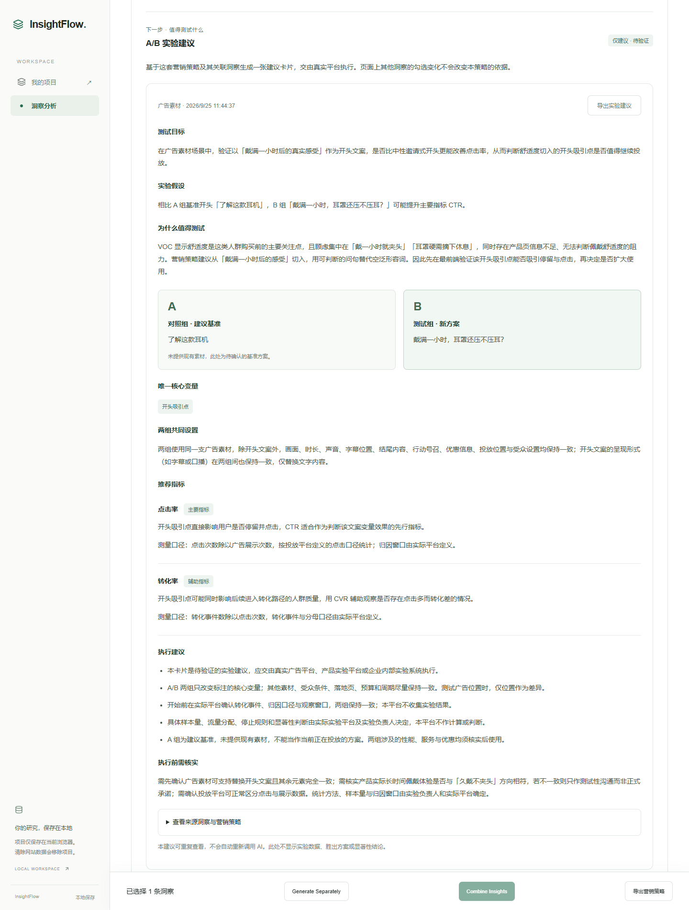

# InsightFlow

**汇集多来源 VOC，将用户反馈转化为有依据的营销决策。**

Online Demo：[InsightFlow](https://insightflow-sable-five.vercel.app)（公开演示版，无需登录，可使用 DeepSeek 分析）。

InsightFlow 是面向营销人员、产品经理与品牌研究者的 Web 工作台。它帮助用户从多语言评论中识别需求、痛点与购买动机，将可追溯的洞察转成中文营销策略和实验建议。

> 快速体验：打开在线 Demo，按 [演示数据说明](docs/demo/README.md) 粘贴三组评论。全部演示品牌与评论均为人工构造；AI 结果不是市场研究结论。
> 访问说明：Vercel 链接在部分中国大陆网络中可能无法直连。可先浏览下方截图和案例。

## 为什么做这个项目

评论分散在不同平台、品牌和时间段，人工整理耗时，也容易把个别声音误当成普遍需求。InsightFlow 将原始评论、证据和营销建议连起来，让团队能检查“为什么值得做”，而不仅得到一段缺少依据的总结。

## 核心功能

- 多来源 VOC 输入：一个自有品牌、多个竞品；支持多平台、多时间段及多语言。
- 保守清洗与拆分：原文完整保留，可检查异常、短评论和排除项。
- 分批 AI 分析：主题、情感、痛点、需求、购买驱动与障碍；支持检查点续跑。
- 条件对比：平台、时间及品牌比较；机会缺口要求双边 VOC 证据。
- Insights：引用原文、证据强度、营销优先级、选择与排序。
- Marketing Action：单条生成或合并洞察，输出价值主张、卖点、创意及渠道/版位理由。
- A/B Test Recommendation：目标、假设、A/B 方案、单一变量、指标和执行建议。
- IndexedDB 本地保存；桌面优先，兼顾手机布局。

所有生成分析和建议统一中文；代表性评论保留原文，可附中文翻译。人群仅使用需求标签，不推测人口属性。实验建议并非已验证结论；本应用不执行广告、不分流、不做显著性检验或自行确定样本量。

## 产品流程

创建项目 → 输入来源与评论 → Preview 核对并确认 → 分批分析 → 查看/选择 Insight → 生成营销策略 → 生成实验建议 → 交给实际平台执行。

## 技术栈

Next.js App Router、React、TypeScript、Recharts、IndexedDB（idb）、Ajv / JSON Schema、Zod。默认服务商为 DeepSeek，保留 OpenAI 适配。API 密钥仅由服务端环境变量读取。

## 本地运行

需要 Node.js **24.x** 和 npm。依赖版本锁定在 package-lock.json。

```sh
npm ci
```

复制 `.env.example` 为 `.env.local`，在本地编辑器中填写服务端变量，然后运行：

```sh
npm run dev
```

打开 http://localhost:3000 。浏览器需支持 IndexedDB。保持服务进程运行，否则 localhost 会拒绝连接。固定使用相同域名和端口；localhost 与 127.0.0.1 不共享浏览器存储。

验证及本地生产运行：

```sh
npm run lint
npm run typecheck
npm test
npm run build
npm start
```

常规测试使用模拟响应，不消耗模型额度。`npm run test:sample` 是可选的 Windows 真实调用验收脚本，依赖未公开的根目录样例数据文档及本地密钥，不用于 CI 或 Vercel 构建。

## 环境变量

| 变量 | 用途 |
| --- | --- |
| AI_PROVIDER | deepseek（默认）或 openai |
| DEEPSEEK_API_KEY | DeepSeek 服务端密钥，本地或部署控制台填写 |
| DEEPSEEK_MODEL | 默认 deepseek-flash，需确保账户可用 |
| OPENAI_API_KEY | 仅切换至 OpenAI 时需要 |
| OPENAI_MODEL | OpenAI 模型，默认值见 .env.example |
| INSIGHTFLOW_ENABLE_PUBLIC_AI | 默认 false；公开站点的三个 AI 接口均关闭，设 true 才允许调用 |

不使用 NEXT_PUBLIC_ 存放密钥。不要将密钥放进 README、截图、源码、提交信息或日志。环境变量修改后需重启本地服务或重新部署。模板只包含空密钥字段。

## 数据、安全与成本边界

输入和预览在浏览器处理。开始分析时，纳入评论和必要来源发送至配置的 AI 服务商；生成策略与实验建议也会发送选中的证据。结果和检查点保存在当前浏览器，不提供跨设备同步。清除站点数据、更换浏览器或域名后无法自动恢复；部署不会迁移 localhost 的项目。

模型返回值会经过结构、中文、引用和来源核验；核验不能保证解释完全正确。引用不足时不应形成机会。分批聚合及全量证据核验可能产生较多调用；重试也可能收费，用量和金额以服务商账单为准。

目前没有账号系统或持久化全站预算。实例内限流、并发限制和缓存不能防止跨实例滥用；同源检查不是身份认证。公开开启 AI 会让访问者消耗部署者额度。部署时先保持公开开关关闭，再配置供应商预算/告警和 Vercel 访问保护，验证后按用途开放。

## 仓库结构

```text
src/app/                页面及三个服务端 AI 接口
src/components/         输入、预览、洞察、策略和实验建议
src/lib/analysis/       分批分析、校验、服务商适配、检查点执行
src/lib/storage/        IndexedDB 持久化
src/lib/marketing/      策略输出契约
src/lib/experiments/    实验建议契约与存储
src/lib/voc/            评论清洗与拆分
src/types/              数据类型
src/hooks/              项目保存与读取
schemas 位于 docs/ai-analysis/，被运行时代码直接引用
scripts/                可选本地样例验收
tests/                  离线回归测试
```

原始研究文档、个人结果截图、`.local/`、环境文件及构建产物不纳入 Git。文档中的历史验收记录不代表每次模型调用都能成功。

## Demo 截图

以下截图来自同一人工演示项目的真实页面。完整过程见 [案例说明](docs/demo/case-study.md)，可复制的输入见 [演示数据](docs/demo/README.md)。

### 1. 项目工作空间


### 2. 多来源 VOC 输入


### 3. 清洗与预览


### 4. 有证据的洞察




### 5. 营销策略工作台


### 6. A/B 实验建议


## GitHub 与 Vercel

完整步骤见 [部署指南](docs/deployment.md)，本次检查结果见 [上线前检查](docs/preflight.md)。已完成 Vercel 生产部署；经项目所有者确认，已开放无需登录的完整 AI 演示。部署记录见 [首次上线记录](docs/first-deployment.md)。

完整流程的实测、修复和剩余限制见 [Step 11 产品验收](docs/phase-11-qa.md)。

## Future Roadmap

- 扩充多语言及杂乱粘贴格式的质量评估集。
- 降低证据核验成本，改善长任务状态与失败恢复。
- 增加项目导出/导入与备份。
- 完善公开演示的预算限制和滥用防护。
- 增加更多经过验证的策略与实验建议模板。

不在当前 MVP 范围：账号、支付、复杂云数据库、社媒自动爬虫、Reddit/TikTok 官方 API、广告执行与实验统计。

## Open-source references / acknowledgements

产品研究阶段的参考项目（来自项目提供的参考清单）：

- [Harken](https://github.com/VladUZH/harken)：多来源分析的研究参考。
- [reviewers-dashboard](https://github.com/aakinolaj/reviewers-dashboard)：评论工作台交互参考。
- [cust_review_bertopic](https://github.com/micheldpd24/cust_review_bertopic)：评论主题分析参考。
- [Rereflect](https://github.com/haqaliz/rereflect)：痛点与业务洞察参考。

这些链接是致谢，不表示本项目使用其代码或获得其授权；后续复用代码前须检查对应许可证。感谢 Next.js、React、Recharts、idb、Ajv、Zod 等依赖的维护者，各依赖遵循其自身许可证。

项目尚未选择开源许可证；公开 GitHub 仓库不等于授予他人开源使用许可。正式以开源项目发布前，由项目所有者选择许可证并加入 LICENSE。
